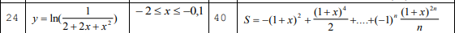
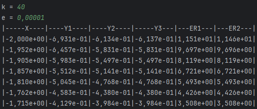
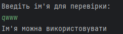

<h1 align="center">Лабораторна робота №1</h1>
<h2 align="center">Тема: Введення у мову програмування Java. Віртуальна машина Java. Базові засоби мови Java.</h2>
<h2 align="center">Виконав студент групи 6.1221</h2>
<h2 align="right">Федотов Євгеній Євгенійович</h2>
<h2 align="right">Варіант 24</h2>
<h3 align="center">Завдання 1</h3>

Для x, що змінюється від a до b з кроком n, обчислити функцію f(x), використовуючи її розкладання у степеневий ряд у трьох випадках:

<ul>
  <li>для "точного" значення (за аналітичною формулою)</li>
  <li>для заданого k (запитати в користувача)</li>
  <li>для заданої точності e (запитати в користувача)</li>
</ul>
<h3 align="left">Значення варіанту:</h3>

<h3 align="left">Результат:</h3>

<h3 align="center">Завдання 2</h3>
<h3 align="left">Значення варіанту:</h3>

Перевірити, чи є введений рядок ідентифікаторм мови програмування.

<h3 align="left">Результат:</h3>

